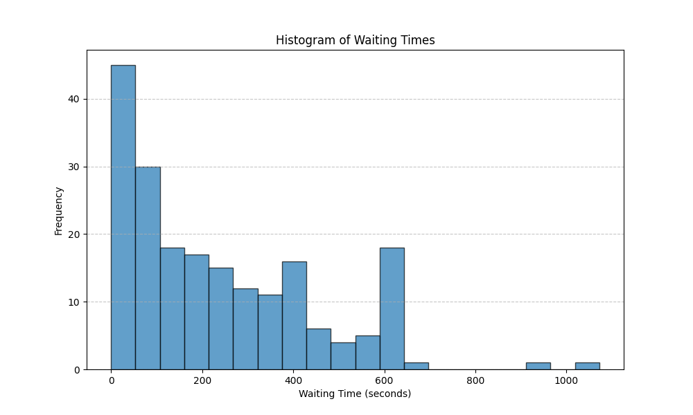
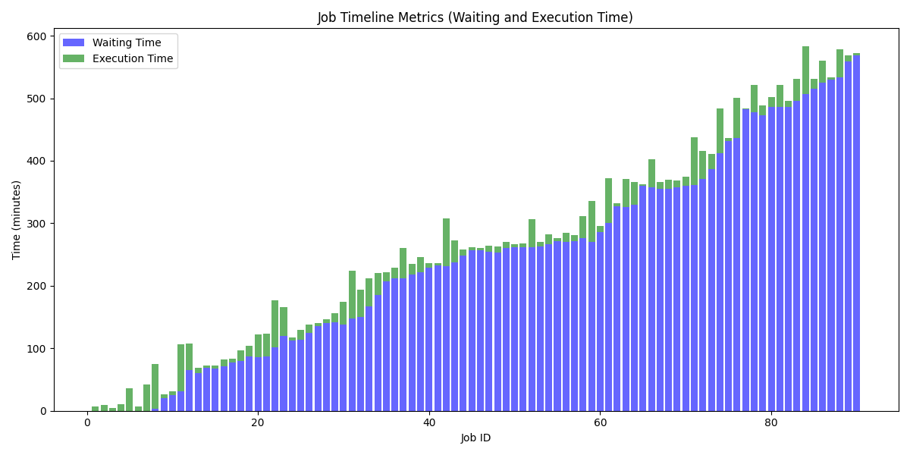

# Philly Trace Analyser and Task Mapper

This repository analyzes Philly trace and also makes it possible to map tasks to a window of tasks submitted to a system based on the pattern available in the Philly trace.

## Goal
To provide a realistic pattern of coming tasks into a deep learning training system for having more realistic evaluation of the proposed schedulers and resource managers.

## Philly Trace Sampler
This script extracts a sequence of submitted jobs from the Philly cluster trace, filters out failed jobs, and writes their inter-arrival (wait) times to a CSV file. It's useful for generating realistic workload traces for scheduling or simulation experiments.

### Usage
```bash
python philly_trace_sampler.py --num_samples 60
```

The output CSV file contains a sequence of job submission gaps (inter-arrival times) sampled from the Philly cluster trace.


Each row represents one job:
- **Column 1** (`waiting_time`): Time in **seconds** since the previous job was submitted.
  - The first job has a waiting time of `0`.
- **Column 2** (`tasks`): used as a placeholder (e.g., for job count).


This file can be used to:
- Simulate job arrival patterns in workload replay or scheduling experiments.
- Analyze burstiness or submission frequency.


### Waiting Time Histogram Plotter

This script reads a CSV trace file containing inter-arrival (waiting) times between job submissions (e.g., generated from the Philly trace) and visualizes their distribution using a histogram.

## What It Does
- Loads a CSV file where each row represents:
  - Column 1: `waiting_time` (in seconds)
  - Column 2: Placeholder value (`1`)
- Computes and prints the **total accumulated waiting time** across all jobs.
- Plots a histogram of `waiting_time` values to reveal patterns such as:
  - Burstiness
  - Gaps between submissions
- Saves the histogram to `waiting_time_histogram.png`.

## Usage

```bash
python plot_waiting_time_histogram.py --csv_file philly_trace_200_tasks.csv
```


An example of its output:




## Philly Scenario Mapper

This script generates a shell script (`philly_scenario.sh`) that simulates job submissions over time based on a Philly cluster trace. It uses real inter-arrival times from a CSV file and randomly samples synthetic job commands to replay a realistic mixed workload.

### 🔧 What It Does

- Reads a CSV trace file (`philly_trace_90_tasks.csv`) containing:
  - **Waiting times** between job submissions (in seconds)
  - **Number of tasks** to submit at each step (usually 1 per row)
- For each row in the trace:
  - Writes a `sleep <duration>` command
  - Randomly selects a job command from one of three pools:
    - **Short jobs (< 10 min)** — 45% chance
    - **Medium jobs (10–60 min)** — 45% chance
    - **Long jobs (> 1 hr, 2 GPUs)** — 10% chance
- Outputs a script (`philly_scenario.sh`) that can be executed to simulate job arrivals in real time.

> 💡 **Note**:  
> The selection percentages (45%, 45%, 10%) are hardcoded in the script. You can easily change these values in the `weights` argument of the `random.choices(...)` call to better reflect your target workload mix (e.g., more long jobs, fewer short bursts, etc.).


How to use it: 

```bash 
python generate_philly_scenario.py --csv_file philly_trace_90_tasks.csv
```


## Philly Trace Execution Simulator & Visualizer

This script simulates the execution of jobs from a trace script (e.g., `philly_scenario.sh`) over a GPU cluster, and produces runtime metrics and visualizations. It estimates **waiting time**, **execution time**, and **completion time** for each job, assuming a fixed number of GPUs and known task durations.

### 🔧 What It Does

- **Parses a shell script** (`philly_scenario.sh`) with `sleep` and job submission lines.
- Simulates job scheduling over a fixed number of GPUs (default: 4).
- Uses predefined execution times for each job (single-GPU or 2-GPU jobs).
- Calculates for each job:
  - **Waiting time** (how long it waits to be scheduled)
  - **Execution time** (how long it runs)
  - **Completion time**
- Computes **end-to-end simulation time** (in minutes).
- Generates a **stacked bar chart** of job waiting vs. execution times.

### 📈 Output

- Printed metrics:
  - Average waiting time
  - Average execution time
  - Average completion time
  - Total (end-to-end) runtime

- A saved plot: `job_metrics.png`  
  Showing job timelines as stacked bars (waiting time + execution time).


An example of its output:




### 📂 Input

- **Shell trace script** (`philly_scenario.sh`)  
  Must contain lines like:

