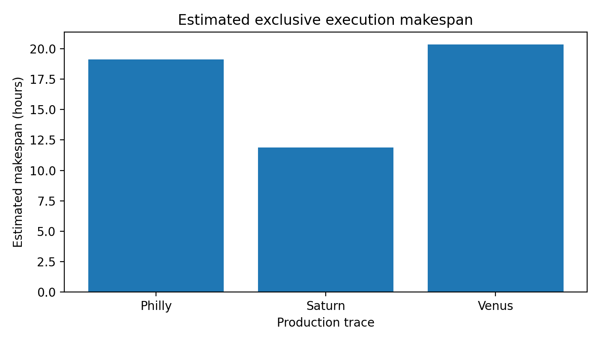
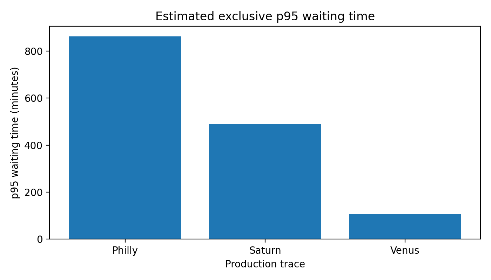
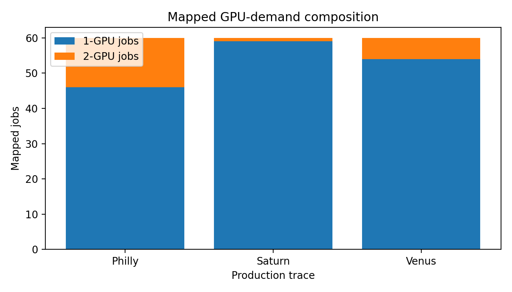

# Generated Trace Comparison

This report is generated by `trace-mapper report-generation-suite` from the mapped-trace manifests.

| Trace | Jobs | 1-GPU | 2-GPU | Unique workloads | Arrival span | Exclusive makespan | Waiting p95 | JCT p95 | Mapping-distance p95 |
|---|---:|---:|---:|---:|---:|---:|---:|---:|---:|
| Philly | 60 | 46 | 14 | 49 | 2.50 h | 19.11 h | 862.32 min | 895.42 min | 0.1923 |
| Saturn | 60 | 59 | 1 | 51 | 0.33 h | 11.90 h | 490.19 min | 505.82 min | 0.0095 |
| Venus | 60 | 54 | 6 | 53 | 19.53 h | 20.35 h | 108.22 min | 166.24 min | 0.1000 |

## Exclusive Makespan

## Waiting Time

## GPU-Demand Composition

The estimates assume arrival-order execution with exclusive GPU allocation on the configured server. They are intended for experiment planning rather than as measured scheduler results.
