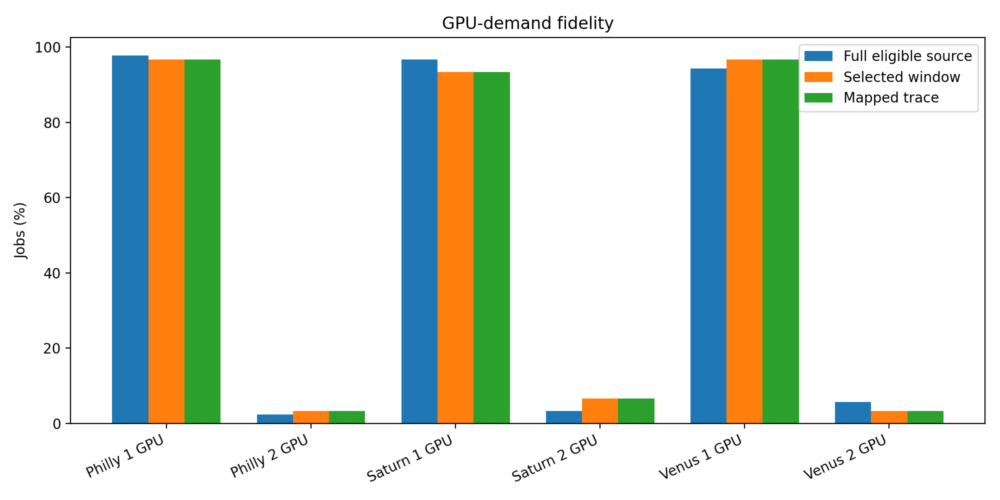
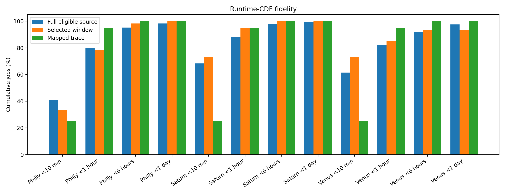
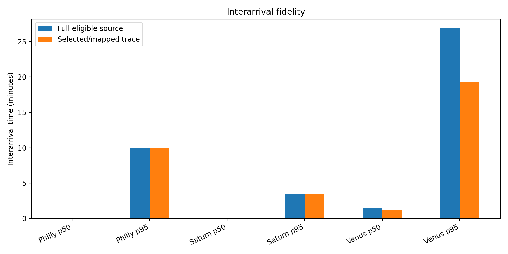
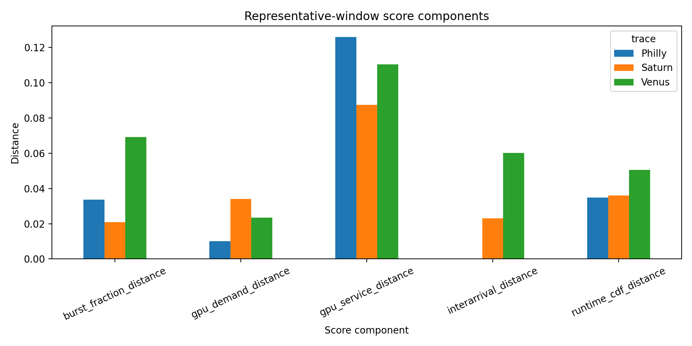

# Representative Trace Fidelity

This report compares each full eligible production population, selected source window, and mapped executable trace.

## Acceptance Summary

| Trace | Score | Max GPU-demand deviation | Mean runtime-CDF deviation | Max runtime-CDF deviation | Max mapped-runtime deviation | 2-GPU jobs | Distinct 2-GPU workloads |
|---|---:|---:|---:|---:|---:|---:|---:|
| Philly | 0.0353 | 1.01% | 3.48% | 7.68% | 16.02% | 2 | 2 |
| Saturn | 0.0399 | 3.40% | 3.60% | 6.92% | 43.31% | 4 | 3 |
| Venus | 0.0557 | 2.35% | 5.07% | 11.83% | 36.50% | 2 | 2 |

## GPU-Demand Fidelity

## Runtime-CDF Fidelity

## Interarrival Fidelity

## Representativeness Score

## Suite-Level 2-GPU Workload Coverage

| Workload | Covered | Traces |
|---|---:|---|
| gpt2_large_wiki_bs8_2gpu | Yes | Philly,Saturn,Venus |
| xlnet_base_cased_wiki_bs8_2gpu | Yes | Saturn |
| xlnet_large_cased_wiki_bs4_2gpu | Yes | Philly,Saturn,Venus |

Selected-window fidelity is evaluated against the corresponding completed 1–2 GPU source population. Mapped-runtime differences are reported separately because the executable workload catalog may have a narrower runtime range than the production trace.
