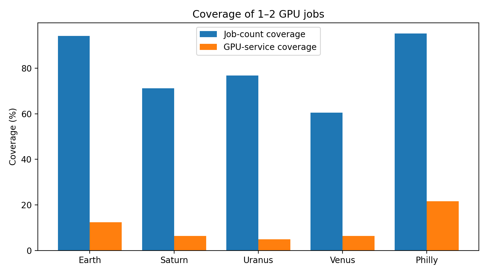
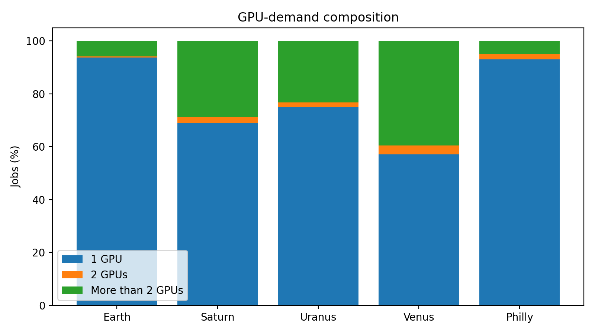
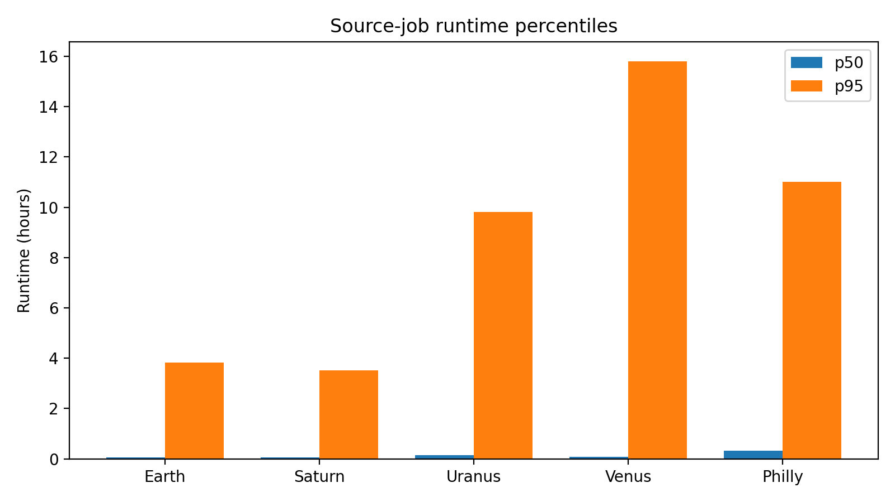
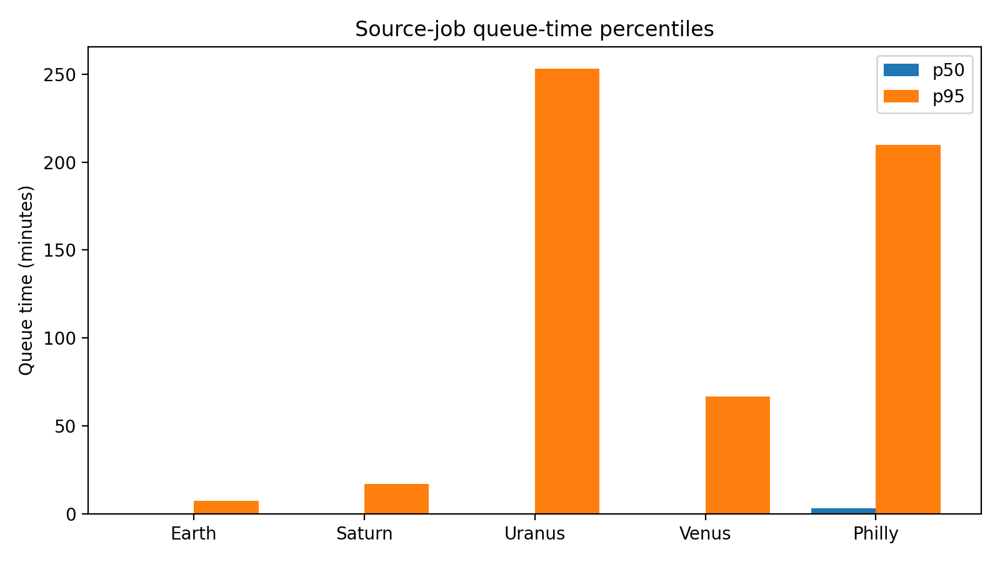

# Production Trace Characterization

This report is generated by `trace-mapper summarize-suite`. It summarizes normalized, successfully completed GPU jobs. The supported subset contains jobs whose GPU demands match the configured target-server scope.

| Trace | Valid jobs | Supported jobs | Job coverage | GPU-service coverage | 1-GPU jobs | 2-GPU jobs | Runtime p50 | Runtime p95 | Queue p50 | Queue p95 |
|---|---:|---:|---:|---:|---:|---:|---:|---:|---:|---:|
| Earth | 313,953 | 295,702 | 94.19% | 12.30% | 93.74% | 0.44% | 240 s | 13812 s | 0 s | 444 s |
| Saturn | 406,982 | 289,626 | 71.16% | 6.39% | 68.84% | 2.33% | 190 s | 12652 s | 0 s | 1009 s |
| Uranus | 199,930 | 153,421 | 76.74% | 4.94% | 75.11% | 1.63% | 538 s | 35296 s | 0 s | 15189 s |
| Venus | 65,912 | 39,846 | 60.45% | 6.32% | 57.02% | 3.44% | 261 s | 56857 s | 0 s | 3989 s |
| Philly | 83,140 | 79,126 | 95.17% | 21.55% | 92.96% | 2.21% | 1124 s | 39630 s | 178 s | 12586 s |

## Supported Testbed Coverage

Job-count coverage measures the fraction of jobs that request one or two GPUs. GPU-service coverage weights each job by its GPU demand and runtime, showing how much total GPU work the supported subset represents.

## GPU-Demand Composition

## Runtime Distribution

## Queue-Time Distribution

Raw production traces are not distributed with this repository. See `data/README.md` for their sources, licenses, and expected local paths.
